# Projects and dependencies analysis

This document provides a comprehensive overview of the projects and their dependencies in the context of upgrading to .NET 9.0.

## Table of Contents

- [Projects Relationship Graph](#projects-relationship-graph)
- [Project Details](#project-details)

  - [ChefKnifeStudios.PokerAttack.AppHost\ChefKnifeStudios.PokerAttack.AppHost.csproj](#chefknifestudiospokerattackapphostchefknifestudiospokerattackapphostcsproj)
  - [ChefKnifeStudios.PokerAttack.ServiceDefaults\ChefKnifeStudios.PokerAttack.ServiceDefaults.csproj](#chefknifestudiospokerattackservicedefaultschefknifestudiospokerattackservicedefaultscsproj)
  - [ChefKnifeStudios.PokerAttack.Shared\ChefKnifeStudios.PokerAttack.Shared.csproj](#chefknifestudiospokerattacksharedchefknifestudiospokerattacksharedcsproj)
  - [Client\ChefKnifeStudios.PokerAttack.Client.Core\ChefKnifeStudios.PokerAttack.Client.Core.csproj](#clientchefknifestudiospokerattackclientcorechefknifestudiospokerattackclientcorecsproj)
  - [Client\ChefKnifeStudios.PokerAttack.Client.Shared\ChefKnifeStudios.PokerAttack.Client.Shared.csproj](#clientchefknifestudiospokerattackclientsharedchefknifestudiospokerattackclientsharedcsproj)
  - [Client\ChefKnifeStudios.PokerAttack.Client.WebApp\ChefKnifeStudios.PokerAttack.Client.WebApp.csproj](#clientchefknifestudiospokerattackclientwebappchefknifestudiospokerattackclientwebappcsproj)
  - [Server\ChefKnifeStudios.PokerAttack.Server.BL\ChefKnifeStudios.PokerAttack.Server.BL.csproj](#serverchefknifestudiospokerattackserverblchefknifestudiospokerattackserverblcsproj)
  - [Server\ChefKnifeStudios.PokerAttack.Server.Core\ChefKnifeStudios.PokerAttack.Server.Core.csproj](#serverchefknifestudiospokerattackservercorechefknifestudiospokerattackservercorecsproj)
  - [Server\ChefKnifeStudios.PokerAttack.Server.Data\ChefKnifeStudios.PokerAttack.Server.Data.csproj](#serverchefknifestudiospokerattackserverdatachefknifestudiospokerattackserverdatacsproj)
  - [Server\ChefKnifeStudios.PokerAttack.Server.Infrastructure\ChefKnifeStudios.PokerAttack.Server.Infrastructure.csproj](#serverchefknifestudiospokerattackserverinfrastructurechefknifestudiospokerattackserverinfrastructurecsproj)
  - [Server\ChefKnifeStudios.PokerAttack.Server.WebAPI\ChefKnifeStudios.PokerAttack.Server.WebAPI.csproj](#serverchefknifestudiospokerattackserverwebapichefknifestudiospokerattackserverwebapicsproj)
- [Aggregate NuGet packages details](#aggregate-nuget-packages-details)

## Projects Relationship Graph

Legend:
📦 SDK-style project
⚙️ Classic project

```mermaid
flowchart LR
    P1["<b>📦&nbsp;ChefKnifeStudios.PokerAttack.AppHost.csproj</b><br/><small>net9.0</small>"]
    P2["<b>📦&nbsp;ChefKnifeStudios.PokerAttack.ServiceDefaults.csproj</b><br/><small>net9.0</small>"]
    P3["<b>📦&nbsp;ChefKnifeStudios.PokerAttack.Shared.csproj</b><br/><small>net9.0</small>"]
    P4["<b>📦&nbsp;ChefKnifeStudios.PokerAttack.Client.Shared.csproj</b><br/><small>net9.0</small>"]
    P5["<b>📦&nbsp;ChefKnifeStudios.PokerAttack.Client.Core.csproj</b><br/><small>net9.0</small>"]
    P6["<b>📦&nbsp;ChefKnifeStudios.PokerAttack.Server.BL.csproj</b><br/><small>net9.0</small>"]
    P7["<b>📦&nbsp;ChefKnifeStudios.PokerAttack.Server.Data.csproj</b><br/><small>net9.0</small>"]
    P8["<b>📦&nbsp;ChefKnifeStudios.PokerAttack.Client.WebApp.csproj</b><br/><small>net9.0</small>"]
    P9["<b>📦&nbsp;ChefKnifeStudios.PokerAttack.Server.WebAPI.csproj</b><br/><small>net9.0</small>"]
    P10["<b>📦&nbsp;ChefKnifeStudios.PokerAttack.Server.Core.csproj</b><br/><small>net9.0</small>"]
    P11["<b>📦&nbsp;ChefKnifeStudios.PokerAttack.Server.Infrastructure.csproj</b><br/><small>net9.0</small>"]
    P1 --> P8
    P1 --> P9
    P4 --> P5
    P5 --> P3
    P6 --> P10
    P6 --> P7
    P8 --> P4
    P9 --> P11
    P9 --> P2
    P9 --> P6
    P10 --> P3
    P11 --> P10
    click P1 "#chefknifestudiospokerattackapphostchefknifestudiospokerattackapphostcsproj"
    click P2 "#chefknifestudiospokerattackservicedefaultschefknifestudiospokerattackservicedefaultscsproj"
    click P3 "#chefknifestudiospokerattacksharedchefknifestudiospokerattacksharedcsproj"
    click P4 "#clientchefknifestudiospokerattackclientsharedchefknifestudiospokerattackclientsharedcsproj"
    click P5 "#clientchefknifestudiospokerattackclientcorechefknifestudiospokerattackclientcorecsproj"
    click P6 "#serverchefknifestudiospokerattackserverblchefknifestudiospokerattackserverblcsproj"
    click P7 "#serverchefknifestudiospokerattackserverdatachefknifestudiospokerattackserverdatacsproj"
    click P8 "#clientchefknifestudiospokerattackclientwebappchefknifestudiospokerattackclientwebappcsproj"
    click P9 "#serverchefknifestudiospokerattackserverwebapichefknifestudiospokerattackserverwebapicsproj"
    click P10 "#serverchefknifestudiospokerattackservercorechefknifestudiospokerattackservercorecsproj"
    click P11 "#serverchefknifestudiospokerattackserverinfrastructurechefknifestudiospokerattackserverinfrastructurecsproj"

```

## Project Details

### ChefKnifeStudios.PokerAttack.AppHost\ChefKnifeStudios.PokerAttack.AppHost.csproj

#### Project Info

- **Current Target Framework:** net9.0
- **Proposed Target Framework:** net10.0
- **SDK-style**: True
- **Project Kind:** DotNetCoreApp
- **Dependencies**: 2
- **Dependants**: 0
- **Number of Files**: 1
- **Lines of Code**: 12

#### Dependency Graph

Legend:
📦 SDK-style project
⚙️ Classic project

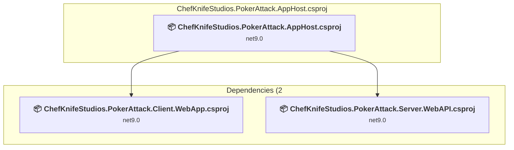

#### Project Package References

| Package | Type | Current Version | Suggested Version | Description |
| :--- | :---: | :---: | :---: | :--- |
| Aspire.Hosting.AppHost | Explicit | 9.3.1 | 13.0.0 | NuGet package upgrade is recommended |

### ChefKnifeStudios.PokerAttack.ServiceDefaults\ChefKnifeStudios.PokerAttack.ServiceDefaults.csproj

#### Project Info

- **Current Target Framework:** net9.0
- **Proposed Target Framework:** net10.0
- **SDK-style**: True
- **Project Kind:** ClassLibrary
- **Dependencies**: 0
- **Dependants**: 1
- **Number of Files**: 1
- **Lines of Code**: 127

#### Dependency Graph

Legend:
📦 SDK-style project
⚙️ Classic project

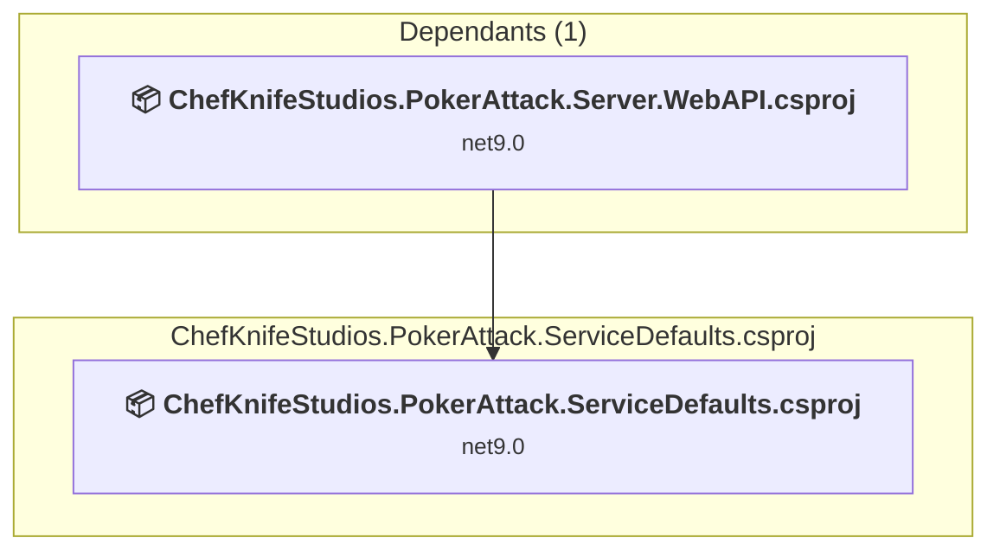

#### Project Package References

| Package | Type | Current Version | Suggested Version | Description |
| :--- | :---: | :---: | :---: | :--- |
| Microsoft.Extensions.Http.Resilience | Explicit | 9.4.0 | 10.0.0 | NuGet package upgrade is recommended |
| Microsoft.Extensions.ServiceDiscovery | Explicit | 9.3.1 | 10.0.0 | NuGet package upgrade is recommended |
| OpenTelemetry.Exporter.OpenTelemetryProtocol | Explicit | 1.12.0 |  | ✅Compatible |
| OpenTelemetry.Extensions.Hosting | Explicit | 1.12.0 |  | ✅Compatible |
| OpenTelemetry.Instrumentation.AspNetCore | Explicit | 1.12.0 | 1.14.0-rc.1 | NuGet package upgrade is recommended |
| OpenTelemetry.Instrumentation.Http | Explicit | 1.12.0 | 1.14.0-rc.1 | NuGet package upgrade is recommended |
| OpenTelemetry.Instrumentation.Runtime | Explicit | 1.12.0 |  | ✅Compatible |

### ChefKnifeStudios.PokerAttack.Shared\ChefKnifeStudios.PokerAttack.Shared.csproj

#### Project Info

- **Current Target Framework:** net9.0
- **Proposed Target Framework:** net10.0
- **SDK-style**: True
- **Project Kind:** ClassLibrary
- **Dependencies**: 0
- **Dependants**: 2
- **Number of Files**: 23
- **Lines of Code**: 280

#### Dependency Graph

Legend:
📦 SDK-style project
⚙️ Classic project

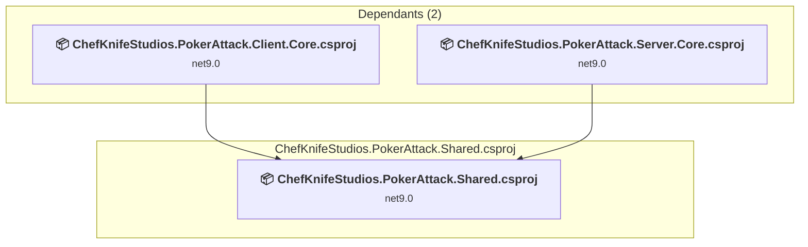

#### Project Package References

| Package | Type | Current Version | Suggested Version | Description |
| :--- | :---: | :---: | :---: | :--- |

### Client\ChefKnifeStudios.PokerAttack.Client.Core\ChefKnifeStudios.PokerAttack.Client.Core.csproj

#### Project Info

- **Current Target Framework:** net9.0
- **Proposed Target Framework:** net10.0
- **SDK-style**: True
- **Project Kind:** ClassLibrary
- **Dependencies**: 1
- **Dependants**: 1
- **Number of Files**: 14
- **Lines of Code**: 1043

#### Dependency Graph

Legend:
📦 SDK-style project
⚙️ Classic project

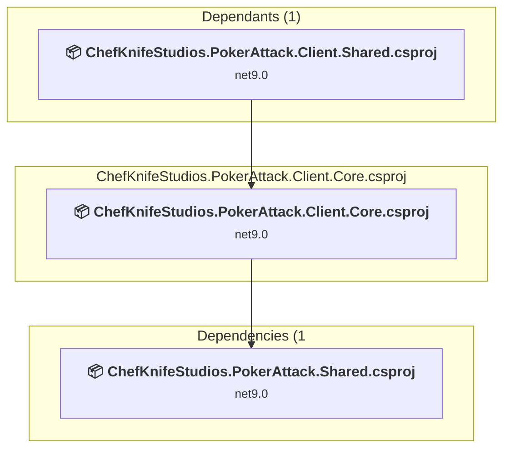

#### Project Package References

| Package | Type | Current Version | Suggested Version | Description |
| :--- | :---: | :---: | :---: | :--- |
| Ardalis.Result | Explicit | 10.1.0 |  | ✅Compatible |
| AutoFixture | Explicit | 4.18.1 |  | ✅Compatible |
| Microsoft.AspNetCore.Components.WebAssembly | Explicit | 9.0.8 | 10.0.0 | NuGet package upgrade is recommended |
| Microsoft.AspNetCore.Components.WebAssembly.Authentication | Explicit | 9.0.8 | 10.0.0 | NuGet package upgrade is recommended |
| Microsoft.AspNetCore.SignalR.Client | Explicit | 9.0.8 | 10.0.0 | NuGet package upgrade is recommended |

### Client\ChefKnifeStudios.PokerAttack.Client.Shared\ChefKnifeStudios.PokerAttack.Client.Shared.csproj

#### Project Info

- **Current Target Framework:** net9.0
- **Proposed Target Framework:** net10.0
- **SDK-style**: True
- **Project Kind:** ClassLibrary
- **Dependencies**: 1
- **Dependants**: 1
- **Number of Files**: 116
- **Lines of Code**: 2347

#### Dependency Graph

Legend:
📦 SDK-style project
⚙️ Classic project

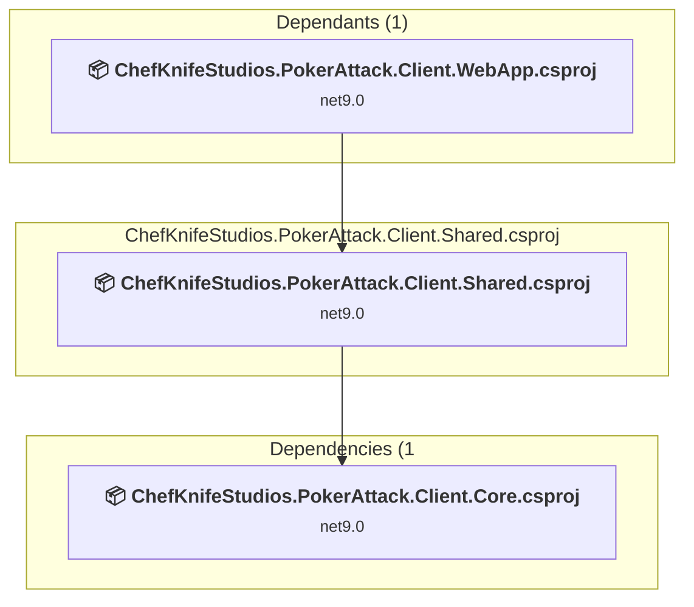

#### Project Package References

| Package | Type | Current Version | Suggested Version | Description |
| :--- | :---: | :---: | :---: | :--- |
| CommunityToolkit.Mvvm | Explicit | 8.4.0 |  | ✅Compatible |
| MatBlazor | Explicit | 2.10.0 |  | ✅Compatible |
| Microsoft.AspNetCore.Components.Web | Explicit | 9.0.8 | 10.0.0 | NuGet package upgrade is recommended |
| NameGenerator | Explicit | 2.0.4 |  | ✅Compatible |

### Client\ChefKnifeStudios.PokerAttack.Client.WebApp\ChefKnifeStudios.PokerAttack.Client.WebApp.csproj

#### Project Info

- **Current Target Framework:** net9.0
- **Proposed Target Framework:** net10.0
- **SDK-style**: True
- **Project Kind:** AspNetCore
- **Dependencies**: 1
- **Dependants**: 1
- **Number of Files**: 19
- **Lines of Code**: 291

#### Dependency Graph

Legend:
📦 SDK-style project
⚙️ Classic project

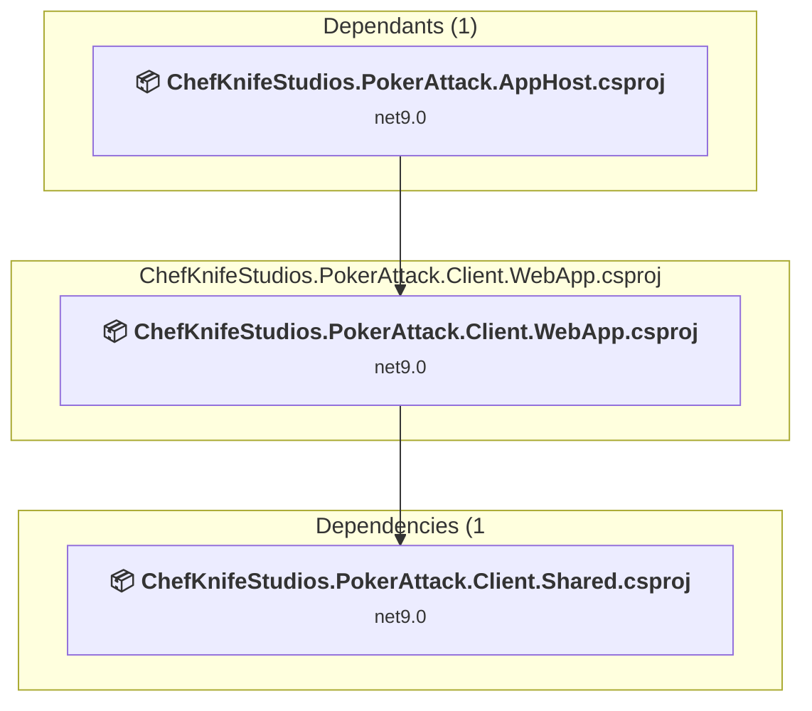

#### Project Package References

| Package | Type | Current Version | Suggested Version | Description |
| :--- | :---: | :---: | :---: | :--- |
| Microsoft.AspNetCore.Components.WebAssembly | Explicit | 9.0.8 | 10.0.0 | NuGet package upgrade is recommended |
| Microsoft.AspNetCore.Components.WebAssembly.DevServer | Explicit | 9.0.8 | 10.0.0 | NuGet package upgrade is recommended |
| Microsoft.Extensions.Http | Explicit | 9.0.4 | 10.0.0 | NuGet package upgrade is recommended |

### Server\ChefKnifeStudios.PokerAttack.Server.BL\ChefKnifeStudios.PokerAttack.Server.BL.csproj

#### Project Info

- **Current Target Framework:** net9.0
- **Proposed Target Framework:** net10.0
- **SDK-style**: True
- **Project Kind:** ClassLibrary
- **Dependencies**: 2
- **Dependants**: 1
- **Number of Files**: 8
- **Lines of Code**: 1557

#### Dependency Graph

Legend:
📦 SDK-style project
⚙️ Classic project

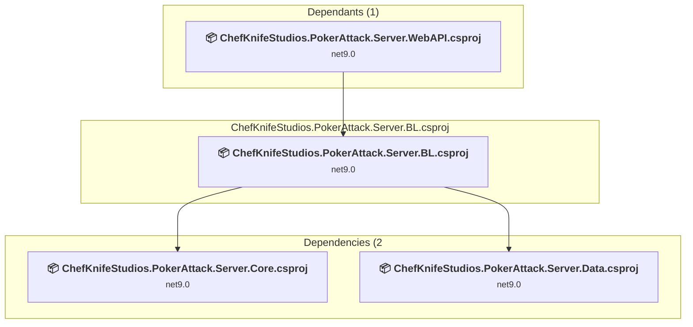

#### Project Package References

| Package | Type | Current Version | Suggested Version | Description |
| :--- | :---: | :---: | :---: | :--- |
| Microsoft.Extensions.Hosting | Explicit | 9.0.10 | 10.0.0 | NuGet package upgrade is recommended |

### Server\ChefKnifeStudios.PokerAttack.Server.Core\ChefKnifeStudios.PokerAttack.Server.Core.csproj

#### Project Info

- **Current Target Framework:** net9.0
- **Proposed Target Framework:** net10.0
- **SDK-style**: True
- **Project Kind:** ClassLibrary
- **Dependencies**: 1
- **Dependants**: 2
- **Number of Files**: 16
- **Lines of Code**: 471

#### Dependency Graph

Legend:
📦 SDK-style project
⚙️ Classic project

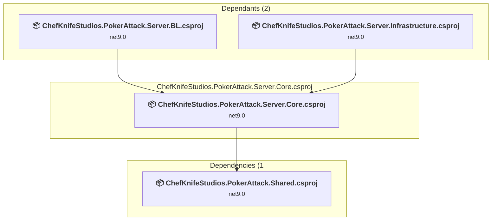

#### Project Package References

| Package | Type | Current Version | Suggested Version | Description |
| :--- | :---: | :---: | :---: | :--- |

### Server\ChefKnifeStudios.PokerAttack.Server.Data\ChefKnifeStudios.PokerAttack.Server.Data.csproj

#### Project Info

- **Current Target Framework:** net9.0
- **Proposed Target Framework:** net10.0
- **SDK-style**: True
- **Project Kind:** ClassLibrary
- **Dependencies**: 0
- **Dependants**: 1
- **Number of Files**: 23
- **Lines of Code**: 1422

#### Dependency Graph

Legend:
📦 SDK-style project
⚙️ Classic project

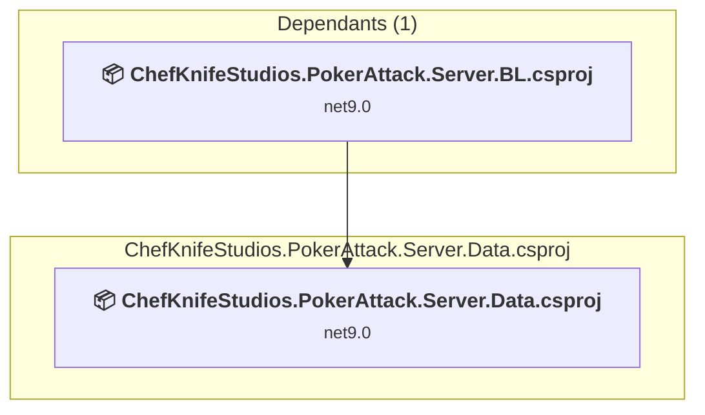

#### Project Package References

| Package | Type | Current Version | Suggested Version | Description |
| :--- | :---: | :---: | :---: | :--- |
| Ardalis.Specification.EntityFrameworkCore | Explicit | 9.3.1 |  | ✅Compatible |
| Microsoft.EntityFrameworkCore | Explicit | 9.0.8 | 10.0.0 | NuGet package upgrade is recommended |
| Microsoft.EntityFrameworkCore.Design | Explicit | 9.0.8 | 10.0.0 | NuGet package upgrade is recommended |
| Microsoft.EntityFrameworkCore.Tools | Explicit | 9.0.8 | 10.0.0 | NuGet package upgrade is recommended |
| Microsoft.Extensions.Configuration.Json | Explicit | 9.0.8 | 10.0.0 | NuGet package upgrade is recommended |
| Npgsql.EntityFrameworkCore.PostgreSQL | Explicit | 9.0.4 |  | ✅Compatible |

### Server\ChefKnifeStudios.PokerAttack.Server.Infrastructure\ChefKnifeStudios.PokerAttack.Server.Infrastructure.csproj

#### Project Info

- **Current Target Framework:** net9.0
- **Proposed Target Framework:** net10.0
- **SDK-style**: True
- **Project Kind:** ClassLibrary
- **Dependencies**: 1
- **Dependants**: 1
- **Number of Files**: 3
- **Lines of Code**: 196

#### Dependency Graph

Legend:
📦 SDK-style project
⚙️ Classic project

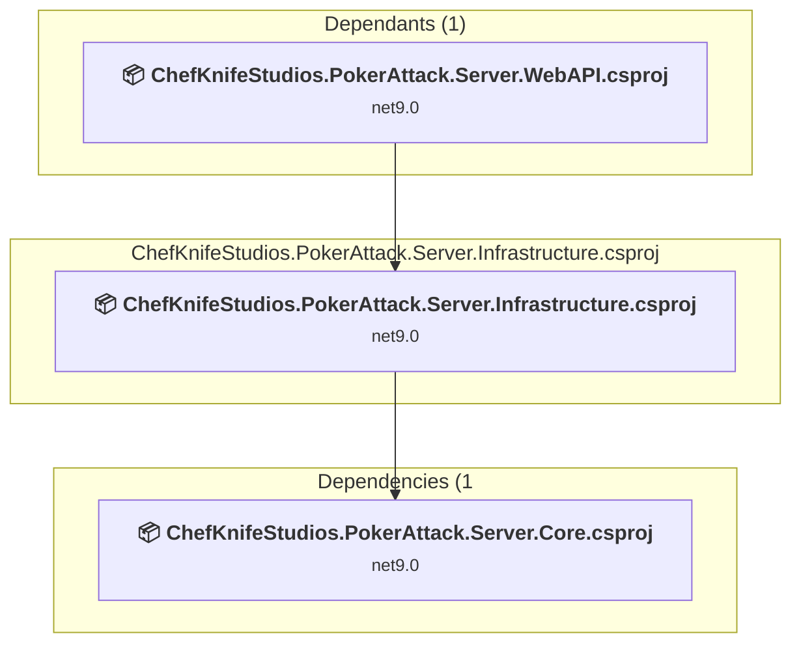

#### Project Package References

| Package | Type | Current Version | Suggested Version | Description |
| :--- | :---: | :---: | :---: | :--- |
| StackExchange.Redis | Explicit | 2.9.17 |  | ✅Compatible |

### Server\ChefKnifeStudios.PokerAttack.Server.WebAPI\ChefKnifeStudios.PokerAttack.Server.WebAPI.csproj

#### Project Info

- **Current Target Framework:** net9.0
- **Proposed Target Framework:** net10.0
- **SDK-style**: True
- **Project Kind:** AspNetCore
- **Dependencies**: 3
- **Dependants**: 1
- **Number of Files**: 11
- **Lines of Code**: 767

#### Dependency Graph

Legend:
📦 SDK-style project
⚙️ Classic project

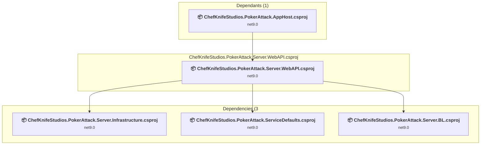

#### Project Package References

| Package | Type | Current Version | Suggested Version | Description |
| :--- | :---: | :---: | :---: | :--- |
| Ardalis.Result | Explicit | 10.1.0 |  | ✅Compatible |
| Microsoft.AspNetCore.OpenApi | Explicit | 9.0.2 | 10.0.0 | NuGet package upgrade is recommended |
| Microsoft.EntityFrameworkCore.Design | Explicit | 9.0.9 | 10.0.0 | NuGet package upgrade is recommended |
| Scalar.AspNetCore | Explicit | 2.6.9 |  | ✅Compatible |

## Aggregate NuGet packages details

| Package | Current Version | Suggested Version | Projects | Description |
| :--- | :---: | :---: | :--- | :--- |
| Ardalis.Result | 10.1.0 |  | [ChefKnifeStudios.PokerAttack.Client.Core.csproj](#chefknifestudiospokerattackclientcorecsproj) [ChefKnifeStudios.PokerAttack.Server.WebAPI.csproj](#chefknifestudiospokerattackserverwebapicsproj) | ✅Compatible |
| Ardalis.Specification.EntityFrameworkCore | 9.3.1 |  | [ChefKnifeStudios.PokerAttack.Server.Data.csproj](#chefknifestudiospokerattackserverdatacsproj) | ✅Compatible |
| Aspire.Hosting.AppHost | 9.3.1 | 13.0.0 | [ChefKnifeStudios.PokerAttack.AppHost.csproj](#chefknifestudiospokerattackapphostcsproj) | NuGet package upgrade is recommended |
| AutoFixture | 4.18.1 |  | [ChefKnifeStudios.PokerAttack.Client.Core.csproj](#chefknifestudiospokerattackclientcorecsproj) | ✅Compatible |
| CommunityToolkit.Mvvm | 8.4.0 |  | [ChefKnifeStudios.PokerAttack.Client.Shared.csproj](#chefknifestudiospokerattackclientsharedcsproj) | ✅Compatible |
| MatBlazor | 2.10.0 |  | [ChefKnifeStudios.PokerAttack.Client.Shared.csproj](#chefknifestudiospokerattackclientsharedcsproj) | ✅Compatible |
| Microsoft.AspNetCore.Components.Web | 9.0.8 | 10.0.0 | [ChefKnifeStudios.PokerAttack.Client.Shared.csproj](#chefknifestudiospokerattackclientsharedcsproj) | NuGet package upgrade is recommended |
| Microsoft.AspNetCore.Components.WebAssembly | 9.0.8 | 10.0.0 | [ChefKnifeStudios.PokerAttack.Client.Core.csproj](#chefknifestudiospokerattackclientcorecsproj) [ChefKnifeStudios.PokerAttack.Client.WebApp.csproj](#chefknifestudiospokerattackclientwebappcsproj) | NuGet package upgrade is recommended |
| Microsoft.AspNetCore.Components.WebAssembly.Authentication | 9.0.8 | 10.0.0 | [ChefKnifeStudios.PokerAttack.Client.Core.csproj](#chefknifestudiospokerattackclientcorecsproj) | NuGet package upgrade is recommended |
| Microsoft.AspNetCore.Components.WebAssembly.DevServer | 9.0.8 | 10.0.0 | [ChefKnifeStudios.PokerAttack.Client.WebApp.csproj](#chefknifestudiospokerattackclientwebappcsproj) | NuGet package upgrade is recommended |
| Microsoft.AspNetCore.OpenApi | 9.0.2 | 10.0.0 | [ChefKnifeStudios.PokerAttack.Server.WebAPI.csproj](#chefknifestudiospokerattackserverwebapicsproj) | NuGet package upgrade is recommended |
| Microsoft.AspNetCore.SignalR.Client | 9.0.8 | 10.0.0 | [ChefKnifeStudios.PokerAttack.Client.Core.csproj](#chefknifestudiospokerattackclientcorecsproj) | NuGet package upgrade is recommended |
| Microsoft.EntityFrameworkCore | 9.0.8 | 10.0.0 | [ChefKnifeStudios.PokerAttack.Server.Data.csproj](#chefknifestudiospokerattackserverdatacsproj) | NuGet package upgrade is recommended |
| Microsoft.EntityFrameworkCore.Design | 9.0.8 | 10.0.0 | [ChefKnifeStudios.PokerAttack.Server.Data.csproj](#chefknifestudiospokerattackserverdatacsproj) | NuGet package upgrade is recommended |
| Microsoft.EntityFrameworkCore.Design | 9.0.9 | 10.0.0 | [ChefKnifeStudios.PokerAttack.Server.WebAPI.csproj](#chefknifestudiospokerattackserverwebapicsproj) | NuGet package upgrade is recommended |
| Microsoft.EntityFrameworkCore.Tools | 9.0.8 | 10.0.0 | [ChefKnifeStudios.PokerAttack.Server.Data.csproj](#chefknifestudiospokerattackserverdatacsproj) | NuGet package upgrade is recommended |
| Microsoft.Extensions.Configuration.Json | 9.0.8 | 10.0.0 | [ChefKnifeStudios.PokerAttack.Server.Data.csproj](#chefknifestudiospokerattackserverdatacsproj) | NuGet package upgrade is recommended |
| Microsoft.Extensions.Hosting | 9.0.10 | 10.0.0 | [ChefKnifeStudios.PokerAttack.Server.BL.csproj](#chefknifestudiospokerattackserverblcsproj) | NuGet package upgrade is recommended |
| Microsoft.Extensions.Http | 9.0.4 | 10.0.0 | [ChefKnifeStudios.PokerAttack.Client.WebApp.csproj](#chefknifestudiospokerattackclientwebappcsproj) | NuGet package upgrade is recommended |
| Microsoft.Extensions.Http.Resilience | 9.4.0 | 10.0.0 | [ChefKnifeStudios.PokerAttack.ServiceDefaults.csproj](#chefknifestudiospokerattackservicedefaultscsproj) | NuGet package upgrade is recommended |
| Microsoft.Extensions.ServiceDiscovery | 9.3.1 | 10.0.0 | [ChefKnifeStudios.PokerAttack.ServiceDefaults.csproj](#chefknifestudiospokerattackservicedefaultscsproj) | NuGet package upgrade is recommended |
| NameGenerator | 2.0.4 |  | [ChefKnifeStudios.PokerAttack.Client.Shared.csproj](#chefknifestudiospokerattackclientsharedcsproj) | ✅Compatible |
| Npgsql.EntityFrameworkCore.PostgreSQL | 9.0.4 |  | [ChefKnifeStudios.PokerAttack.Server.Data.csproj](#chefknifestudiospokerattackserverdatacsproj) | ✅Compatible |
| OpenTelemetry.Exporter.OpenTelemetryProtocol | 1.12.0 |  | [ChefKnifeStudios.PokerAttack.ServiceDefaults.csproj](#chefknifestudiospokerattackservicedefaultscsproj) | ✅Compatible |
| OpenTelemetry.Extensions.Hosting | 1.12.0 |  | [ChefKnifeStudios.PokerAttack.ServiceDefaults.csproj](#chefknifestudiospokerattackservicedefaultscsproj) | ✅Compatible |
| OpenTelemetry.Instrumentation.AspNetCore | 1.12.0 | 1.14.0-rc.1 | [ChefKnifeStudios.PokerAttack.ServiceDefaults.csproj](#chefknifestudiospokerattackservicedefaultscsproj) | NuGet package upgrade is recommended |
| OpenTelemetry.Instrumentation.Http | 1.12.0 | 1.14.0-rc.1 | [ChefKnifeStudios.PokerAttack.ServiceDefaults.csproj](#chefknifestudiospokerattackservicedefaultscsproj) | NuGet package upgrade is recommended |
| OpenTelemetry.Instrumentation.Runtime | 1.12.0 |  | [ChefKnifeStudios.PokerAttack.ServiceDefaults.csproj](#chefknifestudiospokerattackservicedefaultscsproj) | ✅Compatible |
| Scalar.AspNetCore | 2.6.9 |  | [ChefKnifeStudios.PokerAttack.Server.WebAPI.csproj](#chefknifestudiospokerattackserverwebapicsproj) | ✅Compatible |
| StackExchange.Redis | 2.9.17 |  | [ChefKnifeStudios.PokerAttack.Server.Infrastructure.csproj](#chefknifestudiospokerattackserverinfrastructurecsproj) | ✅Compatible |

